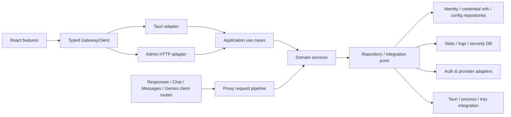
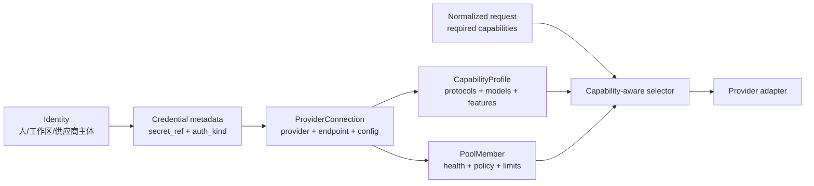
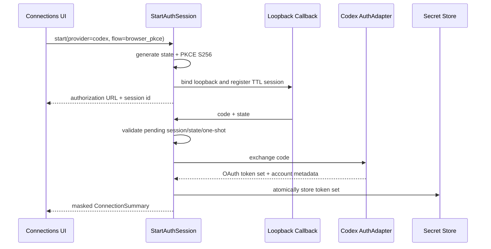

# MyProxy Manager 全仓结构评估与优化计划

> 评估日期：2026-08-13
> 范围：`src/`、`src-tauri/src/`、`scripts/`、`.github/workflows/` 与关键配置文件
> 结论性质：静态结构审查 + 已有构建/测试结果；不包含真实生产流量性能剖析

> 实施进度：Phase 0B 已完成后端认证骨架；schema v3 边界、运行时/公开凭据 DTO 隔离、Codex PKCE/AuthSession、独立 loopback listener、token exchange/refresh、Secret Store 与脱敏测试已落地。应用管理入口、账号记录创建和迁移器待后续切片。

## 1. 执行摘要

当前技术栈和“React/Tauri/Axum 单进程模块化单体”的总体方向合理，不建议重写，也不建议拆成微服务。项目已经具备可工作的端到端骨架、较完整的 Rust 测试和跨平台交付能力，核心问题是功能增长速度超过了模块边界的演进速度。

综合结构健康度评估为 **5.8/10**：

| 维度 | 评分 | 判断 |
|---|---:|---|
| 技术选型与部署形态 | 8/10 | 桌面与 Headless 共用核心能力，方向正确 |
| 后端模块内聚 | 4/10 | 少数巨型文件聚合过多职责 |
| 边界与依赖方向 | 4/10 | `proxy`、`modules`、`commands` 双向穿透 |
| 前端可维护性 | 5/10 | 有 Store/Service 基础，但页面普遍绕过边界 |
| 类型与接口契约 | 4/10 | Tauri、HTTP、TypeScript 三份手工契约存在漂移风险 |
| 测试与交付 | 7/10 | Rust 与跨平台 CI 较强，前端测试为空白 |
| 可观测性与运维 | 6/10 | 日志、监控、统计齐全，但状态和轮询分散 |

系统设计状态主要落在：

- **SD1（局部欠设计）**：持久化、错误、运行时状态没有稳定边界。
- **SD3（集成点缺少统一接口）**：Tauri invoke 与 HTTP API 重复表达同一用例。
- **SD4（关键决策隐式化）**：双运行模式、协议转换、配置热更新等高成本决策缺少 ADR。

最合适的演进策略是：**保持模块化单体，以纵向用例为单位逐步建立契约和边界；先加保护网，再拆热点，最后才考虑物理 crate 拆分。**

### 1.1 产品方向对架构优先级的修正

账号域不能继续以 Antigravity/Google Gemini 的数据形状为中心。当前 `Account + TokenData + TokenManager` 将邮箱、Google OAuth token、project id、设备画像和 Gemini quota 同时当作身份、凭据、连接、能力和调度依据；而已有 Codex 支持主要位于客户端配置及协议转换层，并不是一等上游账号能力。

因此账号平台重构必须前置于一般性的 `TokenManager` 拆分：

1. 产品默认路径转为 OpenAI/Codex，并优先贯通 Responses API；
2. 领域模型拆分为 Identity、Credential、ProviderConnection、CapabilityProfile 和 PoolMember；
3. 认证方式与协议解耦，API Key、OAuth、CLI/外部凭据引用和云凭据通过 adapter 扩展；
4. 客户端协议与上游协议分别建模，以能力要求驱动路由；
5. Gemini/Antigravity 进入 legacy adapter 和迁移路径，不再决定通用 schema；
6. 当前源码内嵌的 Google OAuth client secret 作为 P0 安全事件先移除并在供应商侧轮换。

详细范围和验收见 [`docs/requirements/requirements-account-platform.md`](../requirements/requirements-account-platform.md)。

## 2. 量化现状

本次扫描排除了 `node_modules`、`target` 与构建产物。

| 指标 | 结果 |
|---|---:|
| 前端 TypeScript/TSX/CSS | 约 24,486 行 |
| Rust | 约 74,937 行 |
| 脚本 | 约 848 行 |
| Rust 文件 | 171 |
| 超过 500 行的源文件 | 61 |
| 超过 1,000 行的源文件 | 20 |
| Axum `.route(...)` 声明 | 153 |
| 前端命令映射 | 137 |
| Tauri command 标注 | 149 |
| 前端显式 `any` | 103 |
| 前端测试文件 | 0 |
| Rust 本地测试 | 424 通过、4 忽略 |
| Clippy 历史提示 | lib 约 174、test 约 208 |

主要复杂度热点：

| 文件 | 行数（约） | 当前职责聚合 |
|---|---:|---|
| `proxy/handlers/openai.rs` | 4,360 | Chat、Responses、Images、协议桥接、流式转发 |
| `proxy/server.rs` | 4,073 | 状态容器、启动、路由、管理 API、DTO、业务处理 |
| `proxy/token_manager.rs` | 3,833 | 账号加载、选择、配额、限流、会话、刷新、持久化、OAuth |
| `proxy/mappers/claude/request.rs` | 3,118 | 请求映射、思考预算、工具与上下文策略 |
| `components/proxy/ProxyMonitor.tsx` | 2,202 | 数据获取、轮询、过滤、表格、JSON/Diff/Visual 三套视图 |
| `modules/account.rs` | 2,038 | 索引、文件存储、配额、账号生命周期、迁移兼容 |
| `pages/Settings.tsx` | 1,338 | 多个设置域及保存逻辑 |
| `pages/RouteManager.tsx` | 1,282 | 路由配置、编辑状态与渲染 |
| `pages/Accounts.tsx` | 1,241 | 列表、筛选、拖拽、批量操作、导入导出、弹窗 |

这些热点与最近提交的高频变更区重合，说明它们不仅“大”，而且是持续发生冲突和回归的高风险区域。

## 3. 当前架构判断

### 3.1 做得合理的部分

1. **部署边界合理**：桌面应用与 Headless 代理保持单进程，符合本地网关的延迟、安装和数据隐私要求。
2. **代理子域已经出现正确雏形**：存在 `handlers`、`mappers`、`middleware`、`providers`、`translator`、`upstream` 等目录，不需要推倒重来。
3. **已有依赖注入意识**：`AppState`、`SystemManager`、`AccountService` 已经开始隔离运行环境与业务用例。
4. **协议能力覆盖完整**：OpenAI、Anthropic、Gemini、Codex/Responses 的输入输出路径均有实现和较多 Rust 测试。
5. **交付保护较强**：版本一致性、release asset 验证、跨平台 Tauri 构建和提交/推送前本地验证已经建立。
6. **兼容性意识强**：配置迁移、旧客户端配置恢复、原子写入等机制普遍存在。

### 3.2 核心结构问题

#### A. 同一业务用例存在三份手工接口定义（高优先级）

前端通过字符串命令决定走 Tauri invoke 或 HTTP；后端分别维护 Tauri command 与 Axum route。当前约有 137 个前端映射、149 个 Tauri command、153 个 Axum route，数量已超过人工同步的安全范围。

影响：

- 参数命名、路径占位符、返回 DTO 很容易漂移。
- `request<T>(cmd: string, args?: any)` 将类型错误推迟到运行时。
- Web 与 Desktop 行为可能不同，但没有统一契约测试覆盖。
- 新功能通常需要同时修改 3–5 个位置。

#### B. 后端依赖方向不稳定（高优先级）

扫描发现 `proxy -> modules` 约 111 处，`modules -> proxy` 约 18 处，`commands` 同时依赖两者；`proxy/server.rs` 甚至直接持有 `commands::cloudflared::CloudflaredState`。这形成逻辑上的双向依赖，目录名称不能再代表真实层次。

`AppState` 同时包含鉴权、供应商路由、代理池、监控、配置、账号服务、Cloudflared、协议转换等约 20 个字段；`AxumServer::start` 接收 17 个参数。这是“运行时容器”和“业务服务”混在一起的典型信号。

#### C. 巨型文件承担跨层职责（高优先级）

- `server.rs` 既组装路由，也实现大量管理端 handler 和配置热更新。
- `token_manager.rs` 同时是仓储、选择算法、限流器、会话存储、刷新服务和 OAuth 门面。
- `openai.rs` 同时处理多个端点与多个上游协议。
- `account.rs` 同时操作索引、JSON 文件、配额与业务状态。

这些文件很难进行小范围审查；一次修改容易跨越持久化、并发和协议三个风险面。

#### D. 配置与热更新存在多源状态（高优先级）

配置模型分布在：

- `src/types/config.ts`
- `src-tauri/src/models/config.rs`
- `src-tauri/src/proxy/config.rs`

配置保存后，又分别写入文件、多个 `Arc<RwLock<_>>`、若干 `OnceLock/RwLock` 全局变量、ProviderRouter、TokenManager。Tauri 的 `save_config` 与 HTTP 的 `admin_save_config` 各自实现一套热更新步骤，容易出现其中一条路径漏更新某个组件。

#### E. 可变全局状态影响测试隔离和运行时推理（中高优先级）

项目存在多组可变单例：Thinking 配置、系统提示词、图像模式、代理池、Translator registry/config/metrics、签名缓存、账户重载队列、OAuth flow、日志缓冲等。

不可变映射和正则使用全局 `Lazy` 是合理的；运行时可变配置与会话状态则应归属于一个显式生命周期容器。当前全局状态已经导致测试必须串行并依赖隔离数据目录。

#### F. 持久化分散且同步 I/O 穿透异步路径（中高优先级）

文件与 SQLite 操作散落在 `account`、`token_manager`、`commands`、CLI/OpenCode/Droid sync、日志、配置等模块。`token_manager.rs` 自身就有大量直接文件读写，并在异步业务路径中混用 `std::fs`。

影响：

- 无法可靠地替换为内存仓储做单元测试。
- 写入一致性和原子性策略不统一。
- 大文件或慢磁盘可能阻塞 Tokio worker。
- 错误上下文因大量 `Result<_, String>` 而丢失。

#### G. 前端架构边界只存在于目录名（高优先级）

虽然已有 `services`、`stores`、`hooks`，但约 26 个文件直接使用通用 request，许多组件直接 invoke；只有少数组件通过 service。`useConfigStore`、`useProxyConfig`、ProxyMonitor 又各自加载或保存配置，形成重复 server-state。

巨型页面同时管理远端状态、UI 状态、定时器、事件订阅和展示。ProxyMonitor 单文件含 JSON tree、diff、visual view、log table、数据轮询等多个独立组件，27 个 React hooks 是明显拆分点。

#### H. 前端缺少自动化测试（高优先级）

当前没有 `*.test.ts(x)` 或 `*.spec.ts(x)`。Rust 测试覆盖了大量映射与路由逻辑，但以下风险没有保护：

- Tauri/HTTP 参数序列化一致性。
- Store 的加载、错误与并发行为。
- 设置保存与热更新交互。
- 账号批量操作与监控筛选。
- 关键桌面/Web 用户路径。

#### I. 错误模型尚未成为统一边界（中优先级）

已有 `AppError`，但代码中仍约有 452 个以 `String` 为错误的 `Result`。HTTP handler、Tauri command、业务服务各自拼接文本，前端只能依赖字符串或 `String(error)`。

#### J. 构建体积和页面加载未优化（中优先级）

所有页面在 `App.tsx` 静态导入，当前主 JS 约 2.28 MB（gzip 约 656 KB），Vite 已发出 chunk 警告。路由级懒加载是低风险高收益项。

#### K. 存在未启用的遗留 HTTP Server（低至中优先级）

`modules/http_api.rs` 仍包含一套独立 Axum server，但当前只使用其 settings 读写，没有发现 `spawn_server/start_server` 的调用。它与 `proxy/server.rs` 的管理 API 重叠，增加理解成本，应确认后删除 server 部分或迁移 settings 到独立配置模块。

### 3.3 账号平台的具体耦合证据

| 当前代码 | 当前假设 | 目标边界 |
|---|---|---|
| `models/account.rs` | `Account` 同时持有邮箱、单一 TokenData、设备画像、Gemini quota 与调度状态 | Identity、Credential、Connection、Usage、PoolMember 分离 |
| `models/token.rs` | 所有凭据都有 access/refresh token、email、project id 和 Antigravity session | 按 `auth_kind` 判别的 credential metadata + SecretRef |
| `modules/oauth.rs` | Google OAuth 端点、Antigravity 环境变量和默认客户端写入通用 OAuth 模块；源码包含 client secret | provider-specific AuthAdapter；秘密迁出源码并轮换 |
| `proxy/token_manager.rs` | 账号文件、Google token 刷新、project id、quota、选择与会话统一在巨型 manager | repositories、AuthAdapter、ConnectionCatalog、SelectionEngine 分离 |
| `proxy/config.rs::ProviderProtocol` | provider 主要是 API Key + base URL，协议枚举数量固定 | ProviderConnection 声明多协议与能力，adapter 可扩展 |
| `proxy/translator/format.rs` | 已有 Codex/Responses 格式转换，但不是上游身份或凭据模型 | translator 只负责 wire format，不承担账号语义 |
| `proxy/upstream/client.rs` | 默认上游客户端携带 Google v1internal、设备身份和 Antigravity header 假设 | 每个 provider adapter 独立构造端点、认证与 headers |
| `CLIProxyAPI/internal/auth/codex`（外部参考） | 已实现 Codex PKCE、localhost callback、device flow、token refresh 和账号 claim 提取 | 作为 Codex AuthAdapter 行为样本，经安全收紧后 Rust 化 |

这说明项目并非“缺少一个 Codex 枚举值”，而是账号聚合边界本身需要调整。只在旧 `Account` 上增加 `provider_type` 会继续放大可选字段、秘密泄漏和路由分支，不能作为目标方案。

## 4. 目标架构

保持一个仓库、一个 Rust 应用核心和一个本地进程，采用清晰的模块化单体：



### 4.1 后端模块边界

建议先在现有 crate 内建立以下目录，不立即拆 Cargo workspace：

```text
src-tauri/src/
├── domain/
│   ├── accounts/          # 旧 Account API 兼容门面与迁移入口
│   ├── identity/          # Identity、Credential 元数据与生命周期
│   ├── connections/       # ProviderConnection、能力与健康状态
│   ├── routing/           # provider/account/model 选择规则
│   ├── sessions/          # sticky binding、rate-limit 状态
│   └── protocol/          # 稳定的规范化请求/响应类型
├── application/
│   ├── connections/       # create/validate/disable/reauthorize 用例
│   ├── legacy_accounts/   # 旧 add/switch/delete/refresh 兼容用例
│   ├── config/            # load/save/apply 单一路径
│   └── proxy/             # 请求执行管线与重试编排
├── adapters/
│   ├── inbound/tauri/     # 只做 DTO 转换与错误映射
│   ├── inbound/http/      # admin 与 AI routes
│   └── outbound/          # fs/sqlite/oauth/upstream/desktop
└── runtime/               # AppRuntime、启动、关闭、后台任务
```

关键规则：

1. `domain` 不依赖 Tauri、Axum、rusqlite 或文件系统。
2. `application` 只依赖 domain 与少量端口接口。
3. Tauri 和 HTTP 调用同一个 application use case，不复制业务逻辑。
4. mutable singleton 逐步迁入 `AppRuntime`；仅不可变表与正则保留全局静态。
5. 同步文件/SQLite I/O 统一放在 outbound adapter，并明确使用 `spawn_blocking` 或专用线程。

账号域中的 `accounts` 只是兼容门面。目标模型不再要求邮箱或 refresh token：



关键不变量：

- Credential 只保存 `SecretRef`，明文秘密归系统钥匙串或等价 secret store；
- AuthMethod 描述如何取得/解析凭据，WireProtocol 描述如何通信，两者不可合并为“账号类型”；
- provider adapter 声明认证方式、协议、能力发现和错误分类；
- 缺少配额或能力数据表示 `unknown`，不得视为满额或默认支持；
- 任何跨 provider 重试必须保持请求所需能力，不能静默降级工具、图像或 reasoning。

Codex OAuth 采用独立的认证会话管线，不能塞入普通 Connection CRUD handler：



`CLIProxyAPI` 的 `internal/auth/codex`、`sdk/auth/codex.go`、`codex_device.go` 和 OAuth session store 可作为行为参考。实现时必须修正参考代码的安全边界：callback 只绑定 loopback、默认使用 keyring/SecretRef、不开放原始 token 文件下载、不用邮箱文件名作为身份主键，未验签 JWT claim 不参与授权判断。

### 4.2 代理执行管线

不一次性重写全部 mapper。先定义稳定管线阶段，再逐端点迁移：

```text
authenticate
  -> parse & validate
  -> normalize request
  -> resolve capabilities/provider/connection
  -> execute upstream with retry/circuit breaker
  -> normalize response/stream events
  -> encode client protocol
  -> record metrics/logs
```

现有 `translator` 可作为规范化层的起点，但只有在一个端点完成等价性测试后，才迁移下一个端点。优先建立 Responses 的最小非流式与流式闭环，再按风险迁移 Chat、Claude 和 Gemini legacy 路径。

### 4.3 前端边界

采用 feature-first，而不是继续按技术类型扩张：

```text
src/
├── app/                   # router、providers、启动事件
├── features/
│   ├── accounts/
│   ├── connections/
│   ├── proxy-monitor/
│   ├── routing/
│   ├── providers/
│   └── settings/
├── entities/              # Identity、CredentialSummary、Connection、AppConfig 等类型
└── shared/
    ├── api/               # GatewayClient + Tauri/HTTP adapters
    ├── ui/
    └── lib/
```

前端状态规则：

- 远端 server-state 只能通过 feature query/service 访问。
- Zustand 仅保存跨页面 UI 状态或确有必要的客户端状态。
- 配置、账号、日志不再由多个 hook/store 各自维护副本。
- 定时轮询集中管理，可评估 TanStack Query；在完成一个 feature 的 PoC 前不全仓引入。

### 4.4 接口契约

分两步完成：

1. **短期**：创建类型化 `GatewayClient`，每个方法显式声明参数和返回值；Tauri 与 HTTP 只是两个 adapter。
2. **中期**：以 Rust DTO 为唯一来源生成 TypeScript 类型，并增加契约测试，校验每个 Gateway 方法在 Desktop/Web 的序列化结果一致。

不建议同时引入两套代码生成框架。先用 `ts-rs`/Specta 做一个 `AppConfig` 与 `ConnectionSummary` PoC，再根据 Tauri command 支持程度决定；HTTP OpenAPI 仅在管理 API 需要成为公开产品接口时引入。

## 5. 关键架构决策（建议形成 ADR）

| ADR | 建议决策 | 原因 | 重新评估条件 |
|---|---|---|---|
| 001 部署形态 | 保持模块化单体，不拆微服务 | 本地应用、共享状态多，拆服务只增加部署与一致性成本 | 出现独立远程控制平面或多节点需求 |
| 002 双入口 | Tauri/HTTP 共享 application use case | 消除行为漂移 | 无 |
| 003 状态所有权 | mutable runtime state 归 `AppRuntime` | 明确生命周期、提升测试隔离 | 无 |
| 004 持久化 | 文件/SQLite 通过仓储边界访问 | 统一原子性、错误和异步策略 | 数据模型稳定后可评估单一 SQLite |
| 005 协议转换 | 渐进迁移到规范化管线 | 避免一次性重写流式协议 | 等价性测试覆盖全部端点后移除旧路径 |
| 006 前端状态 | server-state 与 UI-state 分离 | 减少重复请求和状态分叉 | 无 |
| 007 crate 拆分 | 暂不拆；先收紧模块边界 | 物理拆分不能自动解决逻辑耦合 | `domain/application` 连续稳定 2–3 个迭代后 |
| 008 账号核心 | Identity、Credential、Connection 分离 | 避免再次绑定单一供应商和认证材料 | 无 |
| 009 秘密存储 | 领域只持有 SecretRef | 阻止日志、API、导出和文件泄密 | 目标平台无法提供可靠 secret store |
| 010 协议路由 | 客户端/上游协议分离，能力驱动选择 | 同一连接可支持多协议且可安全切换 | 无 |
| 011 旧账号 | schema v2 通过 legacy adapter 迁移到 v3 | 保持可恢复且不污染新核心模型 | legacy 使用降至可移除阈值 |

## 6. 分阶段优化计划

所有任务应保持单 PR 尽量少于 400 行有效逻辑变更；纯文件移动可单独提交，不与行为修改混合。

### Phase 0A：账号安全收敛与模型定界（P0，立即）

目标：先停止扩大旧模型和秘密暴露，再开始功能重构。

1. 从源码移除 Google OAuth client secret，并在供应商侧轮换/撤销；检查构建产物、日志和文档是否泄漏。
2. 冻结旧 `Account/TokenData` schema：除迁移修复外不再增加 provider 通用字段。
3. 为账号 JSON、管理 API、事件、日志和导出建立 secret scanning/脱敏测试。
4. 以 `CLIProxyAPI` 为参考实现 Codex browser PKCE 主路径；同步完成原生 adapter 与 Codex CLI 委托的边界 PoC。
5. 定义 Identity、Credential、ProviderConnection、CapabilityProfile、UsageSnapshot 与 schema v3。
6. 选定跨平台 SecretRef/secret store 方案，并用 OpenAI API Key 做最小存取 PoC。

验收：

- 代码与新构建不包含已知 OAuth client secret，旧值已轮换或撤销。
- 普通管理链路与导出无法获得原始秘密。
- schema v3 不要求 email、refresh token、project id 或 quota percentage。
- Codex browser PKCE 可形成可复现 PoC；device code/cache import/CLI 委托分别标注 beta、实验或正式状态。
- callback 只监听 loopback，state/PKCE/超时/取消/重复回调/端口占用测试通过。

### Phase 0B：建立可演进保护网（P0，1 个迭代）

目标：让后续拆分可验证、可回滚。

1. 引入 Vitest + React Testing Library；先覆盖 `GatewayClient`、config store、connection store 和 legacy account facade。
2. 为 Axum admin router 增加 `tower::ServiceExt::oneshot` 合同测试，覆盖 config、connections、legacy accounts、proxy status。
3. 将 CI 前端 job 统一调用 `npm run preflight`，避免本地与 CI 检查集合漂移。
4. 保存当前性能基线：启动时间、首屏 bundle、典型非流式/流式代理延迟与内存。
5. 新增架构约束检查：禁止新增超 1,000 行文件、禁止前端 feature 直接 import `utils/request`、禁止新增 mutable global。
6. 建立 Clippy warning baseline：现有提示暂不一次清零，但任何 PR 不得增加。

验收：

- 至少 10 个前端核心测试；三类 admin contract test。
- CI、本地 pre-commit、pre-push 使用同一命令组合。
- 后续重构能通过快照/契约测试证明行为等价。

### Phase 1：统一双传输契约（P0，1–2 个迭代）

目标：前端不再感知字符串 command mapping。

1. 定义 `GatewayClient` 接口和 `TauriGatewayClient`、`HttpGatewayClient`。
2. 先迁移 config 与 connection 两个纵向切片；旧 account API 只作为兼容 facade。
3. 将参数路径替换、查询参数、错误解析移入 HTTP adapter。
4. 为每个迁移方法加入 Desktop/Web serialization contract test。
5. 删除已迁移组件中的直接 invoke/request；设置 lint/architecture test 阻止回流。
6. 做 Rust DTO -> TypeScript 类型生成 PoC，优先 `AppConfig`、`ConnectionSummary`。

验收：

- config/connection 页面不再使用字符串命令。
- 同一用例在 Tauri/HTTP 返回统一领域错误码和 DTO。
- 前端 `any` 数量下降至少 40%。

### Phase 2：统一配置保存与运行时状态（P0，1–2 个迭代）

目标：配置只有一个写入和热更新入口。

1. 新建 `ConfigService::save_and_apply(config)`。
2. Tauri `save_config` 与 HTTP `admin_save_config` 只做 adapter，调用同一服务。
3. 将 mapping、provider router、proxy pool、security、thinking 等状态组合为分域 runtime state。
4. 把可变配置 singleton 迁入 `AppRuntime`。
5. 配置写入采用统一原子写策略并加入失败回滚/部分应用测试。
6. 对 Web 管理端返回 DTO 做 secret masking，更新 secret 使用“保留/替换”语义。

验收：

- 任一入口保存配置触发完全相同的热更新序列。
- 不存在 handler 直接写配置文件。
- 配置应用失败不会出现“磁盘新、内存旧”或相反状态。

### Phase 3：拆分 Server 与管理 API（P1，1–2 个迭代）

目标：`server.rs` 只负责组装和生命周期。

1. 按域拆 router：`admin/connections`、`admin/legacy_accounts`、`admin/config`、`admin/security`、`admin/stats`、`admin/system`。
2. AI routes 分离为 `routes/openai`、`routes/anthropic`、`routes/gemini`。
3. 将请求/响应 DTO 移入各 inbound adapter。
4. 用 `RouterFactory`/普通 builder function 组装路由，避免宏式抽象。
5. 确认 `modules/http_api.rs` server 未使用后删除其 server 部分，仅保留必要 settings repository。
6. 将 `AppState` 拆成 `RuntimeServices` + 少量按域 state，通过 `FromRef` 提取。

验收：

- `server.rs` 低于 600 行。
- 每个 admin route 模块可独立 contract test。
- 路由清单可自动与前端 HTTP adapter 对照。

### Phase 4：以新账号域替换 TokenManager 内核（P1，2–3 个迭代）

目标：选择算法不直接读写磁盘，业务状态具备明确所有者。

先保留 `TokenManager` 作为 legacy facade，内部依次抽取；新代码不得继续依赖其 Google/Gemini tuple 返回值：

1. `IdentityRepository`、`CredentialRepository` 和 `ConnectionRepository`：v3 元数据与 SecretRef。
2. `LegacyAccountMigrator`：幂等读取 v2，映射为 `google-antigravity-legacy` connection，保留备份和 journal。
3. `AuthAdapter`：API Key、OAuth token set、外部/云凭据引用的验证与生命周期接口。
4. `ProviderAdapter`：端点调用、协议支持、能力发现和 provider 错误分类。
5. `ConnectionCatalog`：连接、能力、健康和 runtime credential 的内存视图。
6. `SelectionEngine`：按 required capability、协议、健康、限流和用户策略筛选；邮箱不再是选择键。
7. `RateLimitRegistry`、`UsageRegistry` 与 `SessionBindingStore`。
8. 后台验证/刷新任务统一交由 `AppRuntime` 管理，使用 cancellation token。

验收：

- 选择与限额策略可用纯内存测试，无文件系统或具体 provider 依赖。
- `token_manager.rs` facade 低于 800 行。
- 异步请求路径不直接调用同步文件/SQLite I/O。
- 测试可并行运行，不依赖全局 test mutex。
- 至少 OpenAI API Key 与 legacy Google OAuth 两类凭据走同一连接用例。
- v2 迁移幂等、失败可恢复，旧文件在稳定期内不被破坏性删除。

### Phase 5：前端按 Feature 拆分（P1，可与 Phase 4 并行）

目标：页面只做组合，数据与展示各自可测试。

拆分顺序按风险收益：

1. ProxyMonitor：`useProxyLogs`、filter state、LogTable、JsonTree、DiffView、VisualView。
2. Connections：query/actions、capability/health filter、list/grid、credential dialogs；Accounts 降为 legacy 迁移视图。
3. Settings：每个设置域独立 form section；统一 dirty/save/reload 机制。
4. RouteManager 与 ProviderManager：编辑器状态机、验证、展示分离。
5. App router 改为 route-level lazy loading。
6. 集中轮询与 Tauri event subscription，组件卸载时统一取消。

验收：

- 页面容器原则上低于 300 行，展示组件低于 250 行。
- 核心 feature 有成功、空数据、错误、并发/取消测试。
- 主 bundle gzip 下降至少 25%，各页面按需加载。

### Phase 6：协议执行管线渐进统一（P2，持续迭代）

目标：以 OpenAI Responses 为首要纵向路径，减少 OpenAI/Claude/Gemini handler 内重复的路由、重试、日志和流式状态逻辑。

1. 定义规范化 `ProxyRequest`、`ProxyResponse` 与 stream event。
2. 先打通 OpenAI Responses 的非流式和流式最小路径，建立 golden fixture。
3. 再迁移 OpenAI Chat、Claude 非流式、Gemini legacy 非流式。
4. 抽取统一 capability/connection resolve 与 upstream retry。
5. 最后迁移其余 SSE 路径；每条路径做 chunk-by-chunk 等价性测试。
6. 清理迁移完成后的 pair mapper 和旧分支，不长期保留双实现。

验收：

- 新增 provider 不需要修改三个协议 handler。
- 非流式与流式 golden fixtures 覆盖 usage、tool call、thinking、错误映射。
- `handlers/openai.rs`、`handlers/claude.rs` 各低于 800 行。

### Phase 7：质量债与可选物理拆分（P2/P3）

1. 分批消除 Clippy 历史提示，最终启用 `-D warnings`。
2. 把 `Result<_, String>` 逐域迁移为 `AppError`/领域错误，并在 adapter 统一映射。
3. 增加覆盖率报告并采用“基线只升不降”，不立即强设全仓 80%。
4. 根据剖析结果优化 SQLite 索引、锁竞争、同步 I/O 和缓存，而不是凭感觉优化。
5. 只有当依赖方向稳定后，再评估 workspace：`myproxy-core`、`myproxy-server`、`myproxy-desktop`。

验收：

- Clippy 全 warnings 阻断。
- 领域层无 Tauri/Axum/文件系统依赖。
- 是否拆 crate 由编译时间、复用需求和依赖图证据决定。

## 7. 推荐的首批 10 个小 PR

| 顺序 | PR | 风险 | 预期收益 |
|---:|---|---|---|
| 1 | 移除/轮换源码内嵌 OAuth secret，增加秘密泄漏回归检查 | 高/P0 | 收敛真实安全风险 |
| 2 | 定义 schema v3 与 Identity/Credential/Connection 纯领域类型 | 中 | 锁定供应商中立核心 |
| 3 | 实现 SecretRef store PoC 与脱敏 DTO contract test | 中高 | 建立凭据安全边界 |
| 4 | 实现 OpenAI API Key connection 验证 | 中 | 首个 API 凭据闭环 |
| 5 | 参考 CLIProxyAPI 实现 Codex browser PKCE + loopback callback | 中高 | 首个 Codex 账号登录闭环 |
| 6 | 打通两类凭据到 OpenAI Responses 并记录能力/健康 | 中高 | 验证端到端目标架构 |
| 7 | 实现 v2 legacy reader、迁移 journal 和回滚 fixture | 中高 | 保证旧用户可迁移 |
| 8 | 定义 GatewayClient，迁移 config/connection/auth session | 中 | 验证双 adapter 模式 |
| 9 | 提取 capability-aware SelectionEngine | 中 | 替代 email/quota 调度 |
| 10 | 加前后端 contract/security tests 并拆 connections/auth session routes | 低中 | 建立保护网、缩小 server.rs |

每个 PR 必须包含：行为不变说明、测试证据、回滚方式、迁移前后依赖变化。Phase 1–4 不应与协议功能新增混在同一 PR。

## 8. 度量与治理

建议每个迭代记录以下指标：

| 指标 | 当前基线 | 目标 |
|---|---:|---:|
| >1,000 行源文件 | 20 | 0（Phase 6 完成） |
| >500 行源文件 | 61 | <15 |
| 前端直接 request/invoke 文件 | 约 26 | 0 |
| 前端显式 `any` | 103 | <20 |
| 前端测试文件 | 0 | 核心 feature 全覆盖 |
| mutable runtime globals | 多组 | 仅保留不可变 globals |
| `Result<_, String>` | 约 452 | adapter 边界外为 0 |
| 主 JS gzip | 约 656 KB | <500 KB，后续按体验调整 |
| Clippy warnings | 174/208 左右 | 0 |

不要把文件行数当成唯一目标。更重要的验收是：

- 一个业务变化是否只修改一个用例及其 adapters。
- 一个 domain test 是否无需 Tauri、网络和磁盘。
- Web 与 Desktop 是否共享同一行为测试。
- 配置和后台任务是否有唯一所有者和明确生命周期。

## 9. Walking Skeleton（建议首先验证的纵向切片）

产品方向确认后，先并列验证两条纵向切片。切片 A 是“添加 OpenAI API Key 连接并完成一次 Responses 请求”：

1. React Connections 表单提交 provider、endpoint 和 API Key；Key 不进入持久前端状态。
2. Tauri 与 HTTP adapter 使用同一 `CreateConnection` DTO 和 application use case。
3. Secret store 保存 Key，领域层只取得 `SecretRef` 和 fingerprint。
4. OpenAI provider adapter 验证凭据并发现/记录能力；失败则回滚未完成连接。
5. 规范化请求声明所需能力，由 selector 选择该连接并通过 Responses 协议执行。
6. UI 展示脱敏标识、能力、健康和最后验证时间。
7. contract/security test 验证两入口行为一致，日志、API、事件和导出均无原始 Key。

这个切片会触达身份/凭据安全、双入口、provider adapter、协议、能力、路由和前端展示，是验证新账号平台边界的最小有价值闭环。完成后再接入 Generic OpenAI-compatible、legacy Gemini 和云凭据，不先横向创建大量空抽象。

切片 B 是“Codex browser PKCE 登录并完成一次 Responses 请求”：

1. 创建短生命周期 AuthSession，生成 state 与 PKCE verifier/challenge。
2. loopback callback 接收 code，校验 session、state、超时和一次性消费。
3. Codex AuthAdapter 交换 token；Secret Store 原子保存完整 token set。
4. 从已校验登录结果提取脱敏 identity/workspace/plan 元数据，创建 ProviderConnection。
5. 请求执行时解析 SecretRef，按需设置 Bearer token 与账号上下文；401 触发单次并发去重刷新。
6. 用 mock token server 覆盖成功、state mismatch、重复 callback、端口占用、refresh token reuse 和敏感值扫描；真实登录只作为显式手工 smoke test。

截至 2026-08-13，切片 B 的后端认证与秘密存储骨架已完成：专用
loopback listener、PKCE 会话、code exchange、刷新去重、跨平台系统
keyring adapter 和 SecretRef 返回边界均有自动化测试。应用运行时对 pending
flow 的所有权、双管理入口、身份验证及 ProviderConnection 创建留在下一切片。

切片 B 借鉴 `CLIProxyAPI` 的流程分层，但不继承其明文 auth 文件下载、全网卡 callback、邮箱文件名和未验签 claim 信任边界。

## 10. 明确不做的事情

- 不重写整个代理核心。
- 不拆微服务，不引入消息队列。
- 不在边界稳定前拆多个 Cargo crate。
- 不一次性替换全部协议 mapper。
- 不为了“纯架构”增加大量一实现一 trait；仅在需要替换、测试或隔离外部依赖时建立端口。
- 不把所有 Zustand 状态迁到新库；只把 server-state 迁到统一 query/service 层。
- 不在没有性能基线时重写缓存、并发或数据库。
- 不读取浏览器 Cookie、保存用户密码或模拟未公开的 Codex/ChatGPT 认证接口。
- 不把 Codex 优先误解为把 Credential 再次绑定到某一种 Responses 或 OpenAI 字段。

## 11. 最终判断

当前项目属于“可持续演进，但维护成本正在快速上升”的阶段。最危险的不是某个单独文件，而是 **同一用例跨前端字符串映射、Tauri command、Axum handler、文件持久化和多个运行时锁重复实现**。

结合 Codex 优先的账号方向，优化顺序修正为：

1. 秘密轮换、泄漏防护与新账号模型定界；
2. OpenAI API Key/Codex OAuth → Responses 双 walking skeleton 与 legacy 迁移保护；
3. 契约测试、双入口共享用例和配置单一所有权；
4. 以 connection/capability/provider adapter 替换 TokenManager 内核；
5. server、前端热点和协议管线渐进拆分；
6. 最后处理全量 lint、覆盖率和可选 crate 拆分。

按此顺序推进，可以在持续发布功能的同时逐步降低耦合，无需停下来做一次高风险“大重构”。
